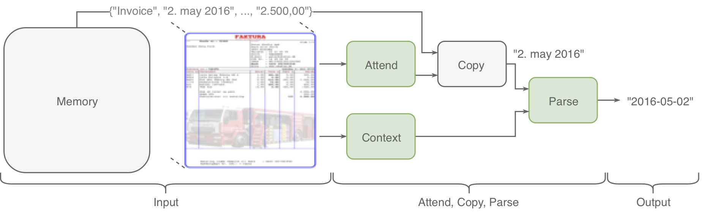
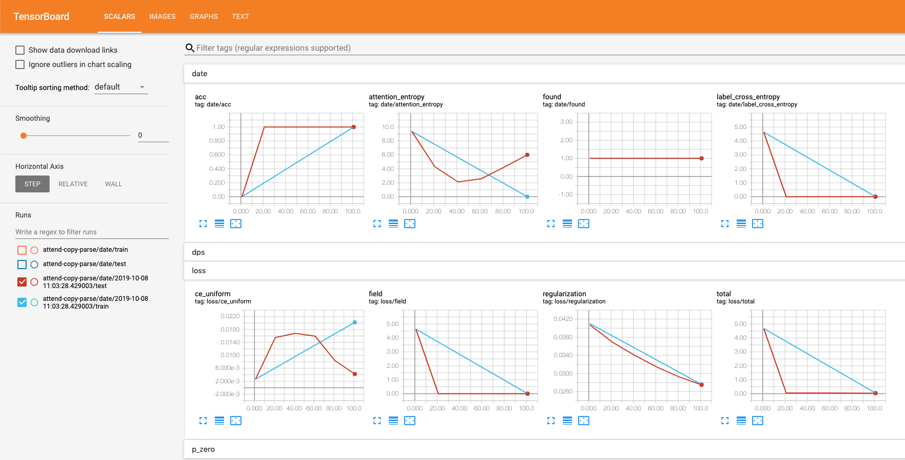
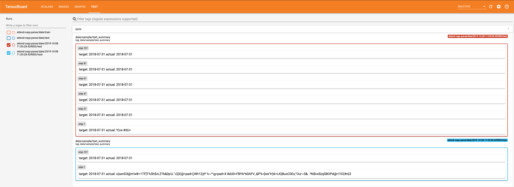
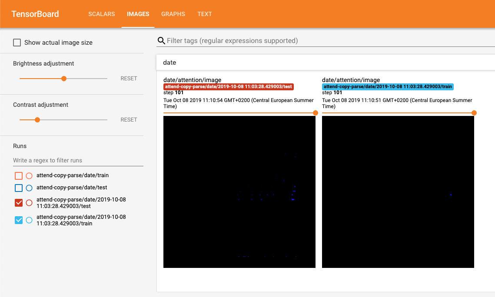

# Attend Copy Parse
Code for paper Attend, Copy, Parse - End-to-end information extraction from documents (https://arxiv.org/abs/1812.07248) by Rasmus Berg Palm, Ole Winther and Florian Laws.

### Pre-train parsers
 * Put data files in `tasks/parsing/data/{amounts,dates}/{train,valid}.tsv` following the format in the sample files.
 * Modify `tasks/parsing/parser.py`: set the `type` variable to train either a `dates` or `amounts` parser.
 * Execute `PYTHONPATH="$PWD" python tasks/parsing/train.py` from the root of the repository

### Train
 * Put data files in `tasks/acp/data`. One document per file, following the format in the sample file.
 * Modify split files in `tasks/acp/splits`. One document per line
 * Modify `field` in `AttendCopyParse` to train on different fields. Valid values are `[number, order_id, date, total, tla, tta, tp]`
 * Execute `PYTHONPATH="$PWD" python tasks/acp/train.py` from the root of the repository
  
### Test
 * Modify `restore_all_path` in `tasks/acp/acp.py` to the saved model to restore weights from, e.g. `./snapshots/acp/best`.
 * Execute `PYTHONPATH="$PWD" python tasks/acp/test.py` from the root of the repository

### General
 * Every 20 training batches the eval split is evaluated. If the eval loss is better than the best seen so far the model is saved under `./snapshots`
 * Tensorboard summaries are logged to `/tmp/tensorboard`

### Ideas for future work

In order of difficulty

 * Apply to more domains
 * Better non-latin support by using better character set (maybe byte-pair encoding)
 * Handle multiple pages
 * Remove the need for N-grams 
 * Take field dependencies into account, e.g. total fields should add up.
 * Output invoice lines

### Screenshots
 
The scalar values logged

Text output samples logged

Attention distribution logged

